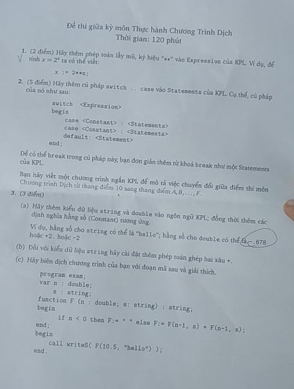

## Môn Thực Hành Chương trình dịch 20192.

### Thông tin
<b>Giáo viên</b>: Trần Vĩnh Đức

<b>Môn học</b>: Thực hành chương trình dịch.

<b>Lớp</b>: CNTT Việt Nhật - ĐH Bách Khoa Hà Nội.

### Đề Thi 
<div style="text-align: center">

</div>

### Cách làm 
Trong các file có mã TODO theo bài -> Search theo TODO
### Cách chạy code 
Fix lỗi thiếu thư viện curse.h trên ubuntu khi chạy bị báo lỗi.

```cmd
$ sudo apt-get install libncurses5
$ sudo apt-get install libncurses5-dev
```

Trong thư mục completed chạy từng câu lệnh sau trong terminal:

```cmd 
$ make clean 
$ make
$ ./kplc ../tests/example2.kpl ../tests/ex2  -dump 
``` 

Make lại file chạy kplc => Chạy để  biên dịch file example2.kpl thành file  binary ex2. Thêm option -dump để xem mã trong Code Buffer sau khi đọc file KPL 

Trong thư mục interpreter chạy các lệnh sau trong terminal:
```cmd
$ make clean
$ make 
$ ./kplrun ../tests/ex2
```

Make lại file chạy kplrun => Chạy file binary ex2 vừa tạo ra để xem kết quả.

#### Bài 1: Thêm hàm mũ vào văn phạm.
Code TODO:1  => Code ở branch: feauture/bai1

token.h 
- Thêm SB_EXP vào enum TokenType

token.c
- Thêm case SB_EXP vào tokenToString()

scanner.c
- Thêm case SB_EXP vào printToken()
- Sửa lại case CHAR_TIMES trong ham getToken

parser.c
- Thêm case SB_EXP vào compileTerm2 => Đọc lại văn phạm.

codegen.h 
- Thêm định nghĩa hàm genEXP(void) 

codegen.c
- Thêm hàm genEXP(void) => Sinh code của hàm mũ

instructions.h trong thư mục completed, interpreter
- Thêm định nghĩa hàm emitEXP() xử lý việc tính toán hàm mũ
- Thêm định nghĩa OP_EXP vào enum Opcode => opcode của phép toán mũ

instructions.c trong thư mục completed, interpreter
- Thêm hàm emitEXP => Tạo mã lệnh xử lý phép toán mũ trong Code buffer 
- Thêm case OP_EXP vào hàm printInstruction() => In lệnh OP_EXP

vm.c 
- Thêm thư viện #include <math.h> => Tính hàm mũ
- Thêm case OP_EXP vào hàm run()  => Xử lý tính toán trong stack

#### Bài 2: Thêm switch case vào văn phạm.
Code TODO:2   => Code ở branch feature/bai2

token.h 
- Thêm KW_SWITCH, KW_CASE, KW_DEFAULT, KW_BREAK vào enum TokenType
- Sửa lại KEYWORDS_COUNT = 24 => Thêm 4 keyword mới vào Token 

token.c
- Thêm các keyword mới vào struct keywords[] 
- Thêm case của keyword  vào tokenToString()

scanner.c
- Thêm case của keyword mới vào printToken();

parser.h
- Thêm định nghĩa hàm compileSwitchSt();

parser.c
- #define MAX_CASE 10  để  tạo các jInstruction trong hàm case.
- Thêm case KW_SWITCH vào complileStatement => Đọc thêm văn phạm mới.
- Thêm case KW_BREAK, KW_DEFAULT, KW_CASE vào compileStatement() => Follow của compileStatement(); (Sau khi compileStatement thì nó sẽ gặp những case này thì sẽ bỏ qua không xử lý Statement).
- Thêm case KW_BREAK, KW_DEFAULT, KW_CASE, KW_BEGIN vào hàm compileExpression3() và hàm compileTerm2()=> Follow của hàm compileExpression(); Sau khi compileExpression() ở switch thì nó sẽ gặp những case này cần bỏ qua.
- Viết thêm hàm compileSwitchSt();
```C
void compileSwitchSt(void ) {
  Instruction* fjInstruction;
  Instruction* jInstructions[MAX_CASE];
  Type* type;
  int count = 0;

  eat(KW_SWITCH);                                   // Ăn KW_SWITCH
  type = compileExpression();                       // compileExpression() => Đẩy giá trị của biến lên trong switch lên đầu stack
  eat(KW_BEGIN);                                    // Ăn KW_BEGIN 
  
  while(lookAhead->tokenType != KW_END) {           
    genCV();                                        // Duplicate giá trị biến vừa đẩy lên stack                           
    switch(lookAhead->tokenType) {                  // Check KW_CASE hay là KW_DEFAULT
      case KW_CASE:
        eat(KW_CASE);
        switch (lookAhead->tokenType) {
          case TK_NUMBER:
            eat(TK_NUMBER);
            checkIntType(type);
            genLC(currentToken->value);             // Load giá trị của constant lên đầu stack
            break;
          case TK_CHAR:
            eat(TK_CHAR);
            checkCharType(type);
            genLC(currentToken->value);             // Load giá trị của constant lên đầu stack
            break;
          default:
            error(ERR_INVALID_CONSTANT, lookAhead->lineNo, lookAhead->colNo);
        }
        // genEQ()  => So sánh 2 giá trị trên cùng của stack 
        genEQ();                                    
        // Tạo 1 False Jump nếu đúng thì thực hiện tiếp còn ko thì nhảy đến vị trí được updateFJ();
        Instruction* fjInstruction = genFJ(DC_VALUE);       
        eat(SB_COLON);
        compileStatements();
        if(lookAhead->tokenType == KW_BREAK) {
          eat(KW_BREAK);
          // Tạo 1 Jump nếu như code trong case đó được thực hiện và gặp KW_BREAK thì nhảy ra ngoài switch-case bằng cách updateJ() ngoài switch-case
          jInstructions[count] = genJ(DC_VALUE);            
          count++;
        }
        // Nếu FJ trả về false thì sẽ nhảy đến đây.
        updateFJ(fjInstruction, getCurrentCodeAddress());       
        break;
      case KW_DEFAULT:
        eat(KW_DEFAULT);
        eat(SB_COLON);
        compileStatements();
        break;
      default:
        error(ERR_INVALID_STATEMENT, lookAhead->lineNo, lookAhead->colNo);
        break;
    }
  } 
  // Update tất cả các hàm J để sau khi tính toán gặp KW_sBREAK thì sẽ nhảy ra đây
  for(int i = 0; i < count; i++) {
    updateJ(jInstructions[i], getCurrentCodeAddress());
  }
  eat(KW_END);              // Ăn KW_END 
}
```

#### Bài 3: Thêm string, double vào văn phạm. (không có phần codegen)
Code TODO:3x   => Code ở branch feature/bai3-not-codegen

charcode.h
- Thêm CHAR_DOUBLEQUOTE vào enum CharCode   => Kí tự bắt đầu của 1 string trong văn phạm

charcode.c
- Sửa CHAR_UNKNOWN sau CHAR_EXCLAIMATION=> CHAR_DOUBLEQUOTE (mã của \" trong bảng ASCII)

token.h
- Thêm KW_STRING, KW_DOUBLE, TK_STRING, TK_DOUBLE vào enum TokenType

token.c
- Định nghĩa KW_STRING, KW_DOUBLE vào mảng các keywords
- Thêm các case mới cho KW và TK vừa thêm vào hàm tokenToString()

scanner.c
- Sửa lại hàm readNumber() để đọc thêm số double.
- Thêm hàm readFloatingPointNumber() để đọc trường hợp số thực bắt đầu bằng dấu .
- Thêm hàm readString() để đọc string.
- Thêm case CHAR_DOUBLEQUOTE vào hàm getToken() => Đọc string
- Sửa lại case CHAR_PERIOD của hàm getToken() => Gọi thêm hàm  readFloatingPointNumber() khi số bắt đầu bằng dấu .      
- Thêm các case của KW, TK mới hàm printToken()

semantics.h
- Thêm định nghĩa các hàm checkNumberType(), checkStringType(), checkTypeAssign(), checkTypeExpression()

semantics.c
- Viết các hàm vừa định nghĩa trong semantics.h

symtab.h
- Thêm 2 type mới TP_DOUBLE, TP_STRING vào enum TypeClass 
- Thêm 2 ô loại ô nhớ doubleValue, stringValue để lưu dữ liệu vào struct ConstantValue
- Thêm định nghĩa các hàm makeDoubleType(), makeStringType() => Tạo kiểu dữ liệu mới
- Thêm định nghĩa hàm priorityType() => Trả về Type có độ ưu tiên cao hơn
- Thêm định nghĩa hàm compareTypeAssign(), compareTypeExpression() => Ép kiểu dữ liệu 
- Thêm định nghĩa các hàm makeDoubleConstant(), makeStringConstant() => Tạo constant mới

symtab.c
- Thêm stringType, doubleType => Sử dụng để extern bên parser.c
- Viết các hàm được định nghĩa trong symtab.h
- Thêm các case TP_DOUBLE, TP_STRING mới vào hàm freeType() => Clean 2 kiểu dữ liệu mới
- Sửa lại hàm duplicateConstantValue() => Duplicate 2 kiểu dữ liệu mới
- Trong hàm initSymTab(), khởi tạo thêm các hàm reads, readd, writes, writec, gán giá trị cho doubleType, stringType khai báo phía trên. 

parse.c
- extern 2 biến stringType, doubleType bên symtab.c sang.
- Sửa lại các hàm liên quan đến constant, type, expression..


debug.c
- Thêm các case của kiểu dữ liệu mới vào printType(), printConstantValue()

error.h
- Thêm ERR_INVALID_DOUBLE vào enum ErrorCode => Báo lỗi khi đọc số double

error.c
- Định nghĩa lỗi ERR_INVALID_DOUBLE trong mảng errors

